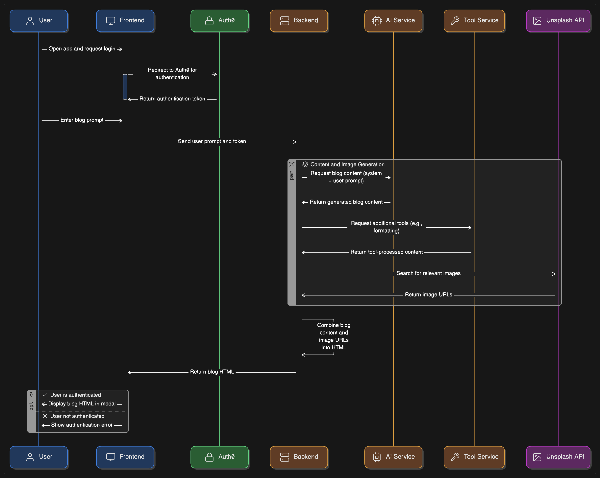

# Blog Producer

A full-stack blog drafting application that uses OpenAI's API to generate blog content based on user-provided images and prompts.

## Features

- Image upload with preview
- Text prompt input
- Blog content generation using OpenAI
- Editable blog preview
- Export to HTML/Markdown

## Prerequisites

- Python 3.8+
- Node.js 16+
- OpenAI API key
- Docker (optional)

## Installation

1. Clone the repository
2. Install backend dependencies:
   ```bash
   cd backend
   pip install -r requirements.txt
   ```
3. Install frontend dependencies:
   ```bash
   cd frontend
   npm install
   ```
4. Set up environment variables:
   - Create `.env` file in the backend directory
   - Add your OpenAI API key: `OPENAI_API_KEY=your_api_key`

## Running the Application

### Without Docker

1. Start the backend server:
   ```bash
   cd backend
   uvicorn main:app --reload
   ```

2. Start the frontend development server:
   ```bash
   cd frontend
   npm start
   ```

### With Docker

1. Build and run the containers:
   ```bash
   docker-compose up --build
   ```

### Build and Push Backend Docker Image (amd64)

To build and push the backend Docker image for amd64 architecture:

1. Authenticate with Docker Hub (if not already):
   ```bash
   docker login
   ```
2. Build the image for amd64:
   ```bash
   docker buildx build --platform linux/amd64 -t <your-dockerhub-username>/<your-repo>:<tag> -f docker/Dockerfile.backend .
   ```
3. (Optional) Push the image to Docker Hub:
   ```bash
   docker push <your-dockerhub-username>/<your-repo>:<tag>
   ```

Or, to build and push in one step:
   ```bash
   docker buildx build --platform linux/amd64 -t <your-dockerhub-username>/<your-repo>:<tag> -f docker/Dockerfile.backend . --push
   ```

Replace `<your-dockerhub-username>`, `<your-repo>`, and `<tag>` as needed.

## Project Structure

```
blog-producer/
├── backend/           # FastAPI backend
├── frontend/          # React frontend
└── docker/           # Docker configuration
```

## System Design

